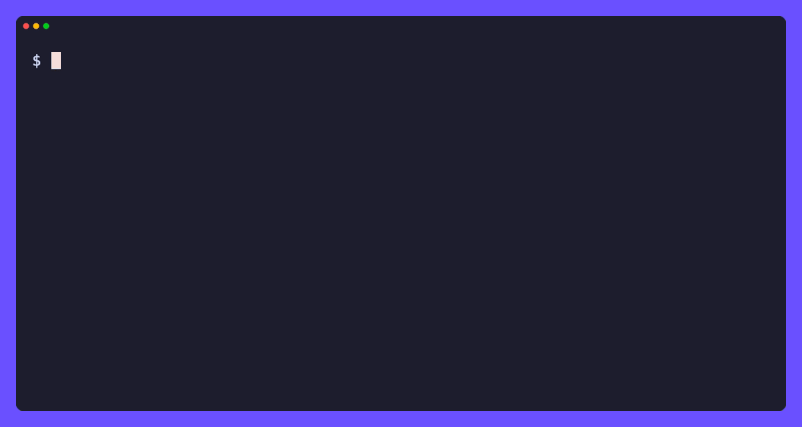

# ccrawl

A fast, friendly command line for [Common Crawl](https://commoncrawl.org).
One binary that finds pages in the URL index, fetches the exact bytes Common Crawl saw, streams WARC/WAT/WET archives, queries the columnar Parquet index, looks up domain ranks, and builds datasets.



Full documentation: [ccrawl-cli.tamnd.com](https://ccrawl-cli.tamnd.com).

## What is Common Crawl

[Common Crawl](https://commoncrawl.org) is a nonprofit that has been crawling the web since 2008 and publishes the result as a free, openly licensed dataset.
Every month or so it releases a new crawl of billions of pages, hosted on `data.commoncrawl.org` and mirrored in Amazon S3.
There are no API keys and nothing to pay for, you just need to know where to look.

That last part is the catch.
Using the data by hand means juggling the [CDX index API](https://index.commoncrawl.org), S3 paths, multi-member gzip WARC files, and a pile of glue code.
ccrawl puts all of it behind one tool with sane defaults, real output formats, and commands that pipe into each other.

> [!IMPORTANT]
> This project is an independent client.
> It is not affiliated with or endorsed by the Common Crawl Foundation.
> Please read and follow the [Common Crawl terms of use](https://commoncrawl.org/terms-of-use) when you use the data.

## Install

```sh
go install github.com/tamnd/ccrawl-cli/cmd/ccrawl@latest
```

Or grab a prebuilt binary from the [releases page](https://github.com/tamnd/ccrawl-cli/releases).
The binary is pure Go with no runtime dependencies.
DuckDB is optional and only needed to run the columnar index queries locally (see [Bulk questions](#bulk-questions-the-columnar-index)).

Build from source:

```sh
git clone https://github.com/tamnd/ccrawl-cli
cd ccrawl-cli
make build      # produces ./bin/ccrawl
```

## Quick start

```sh
ccrawl crawls latest                  # newest crawl ID, for example CC-MAIN-2026-25
ccrawl get example.com --text         # the readable text of the latest capture
ccrawl get example.com --markdown     # the same page as Markdown
ccrawl search 'example.com/*'         # every capture under a path
ccrawl search 'example.com/*' -o url  # just the URLs, one per line
```

Run `ccrawl <command> --help` for the full flag list on any command.
Every command speaks the same global flags, so `-o`, `-c`, `-n`, and `--fields` work everywhere.

> [!TIP]
> ccrawl is built to compose.
> Any command that lists records can pipe into another, so `search` finds captures, `fetch` pulls their bytes, and a shell pipe (`|`) is the glue.

## Find a page: `get`

`get` is curl for Common Crawl.
It resolves the newest capture of a URL in the index, pulls that one record with an HTTP byte-range request, and prints what Common Crawl saw.

```sh
ccrawl get example.com                # the captured HTML
ccrawl get example.com --text         # readable plain text
ccrawl get example.com --markdown     # HTML converted to Markdown
ccrawl get example.com --headers      # the captured HTTP response headers
ccrawl get example.com --links -o url # outbound links, one per line
ccrawl get example.com --at 2023-06   # the capture nearest a date
ccrawl get example.com --all -o jsonl # every capture across crawls
```

The `extract` subcommands are shortcuts for a single transform:

```sh
ccrawl extract text example.com
ccrawl extract links example.com
ccrawl extract title example.com
ccrawl extract markdown example.com -O page.md
```

## Search the index: `search`

`search` queries the URL index (the CDX server) for captures of a URL or pattern.
The match type is inferred from wildcards, and you can always override it with `--match`.

```sh
ccrawl search example.com                    # exact URL, every timestamp
ccrawl search 'example.com/*'                # every URL under a path (prefix)
ccrawl search '*.example.com'                # the domain and all its subdomains
ccrawl search '*.example.com' --status 200   # only successful captures
ccrawl search example.com --mime text/html   # filter by detected MIME type
ccrawl search example.com -c all -n 50        # across every crawl, newest first
ccrawl search example.com --at 2022-06        # the capture nearest a date, per URL
ccrawl search example.com --estimate          # approximate record count per crawl
```

Narrow the columns or shape each row:

```sh
ccrawl search example.com --fields url,status,timestamp
ccrawl search example.com --template '{{.URL}} {{.Status}}'
```

## Fetch by location: `fetch`

`fetch` retrieves WARC records by their exact byte location.
The point is composition: anything that emits location records (filename, offset, length) can pipe straight into it.
`search --locations` and `columnar locations` both do.

```sh
# Every PDF Common Crawl saw on a domain, downloaded one file per record:
ccrawl search 'example.com/*' --mime application/pdf --locations \
  | ccrawl fetch - --dir --out-dir pdfs/

# Read text from records the columnar index found:
ccrawl columnar locations --domain example.com -o jsonl \
  | ccrawl fetch - --text
```

You can also fetch a single record by hand:

```sh
ccrawl fetch --file crawl-data/CC-MAIN-2026-25/.../x.warc.gz --offset 123456 --length 4567 --text
```

## Bulk questions: the columnar index

The columnar (Parquet) index is the fastest way to answer crawl-wide questions like "every PDF on .gov domains" without touching a single WARC.
ccrawl builds the SQL for you and runs it against the public Parquet files using a local `duckdb` binary if one is on your `PATH`.

```sh
ccrawl columnar urls --tld gov --mime application/pdf -o url
ccrawl columnar count --domain example.com
ccrawl columnar langs --tld jp
ccrawl columnar mimes --domain example.com
```

> [!NOTE]
> DuckDB is optional.
> If it is not on your `PATH`, ccrawl prints ready-to-run SQL instead of running it, so nothing is required to get a useful answer.

Ask for the SQL directly with `--print`, then paste it into [DuckDB](https://duckdb.org), Athena, Spark, or Trino:

```sh
ccrawl columnar sql --tld gov --mime application/pdf --print
```

```sql
SELECT url, url_host_registered_domain, fetch_status, content_mime_detected, ...
FROM read_parquet('https://data.commoncrawl.org/cc-index/table/cc-main/warc/crawl=CC-MAIN-2026-25/subset=warc/*.parquet', hive_partitioning=1)
WHERE url_host_tld = 'gov'
  AND content_mime_detected = 'application/pdf'
```

Install DuckDB from [duckdb.org](https://duckdb.org/docs/installation) to run the queries directly.
The ccrawl binary never links DuckDB, so installs stay small and pure Go.

## Raw archives: `paths`, `download`, `parse`, `convert`

Each crawl ships its data as three archive kinds, all on [data.commoncrawl.org](https://data.commoncrawl.org):

- **WARC** holds the full HTTP request and response,
- **WAT** holds extracted metadata and links,
- **WET** holds plain text.

List the archive paths, download them, decode them, and convert them:

```sh
ccrawl paths warc -c 2026-25                   # every WARC path for a crawl
ccrawl paths wet -n 1 | ccrawl download -      # download the first WET file
ccrawl download warc -n 5                       # the first 5 WARC files of the latest crawl
ccrawl parse local.warc.gz --type response -o table -n 20
ccrawl convert local.warc.wet.gz --to parquet -O out.parquet
```

## CC-NEWS

[CC-NEWS](https://commoncrawl.org/blog/news-dataset-available) is a separate, continuously updated dataset of news articles.
It has no URL index, so a host search streams the month's WARC files and keeps matching records.

```sh
ccrawl news list --year 2026 --month 5
ccrawl news search bbc.co.uk --year 2026 --month 5 -n 50
```

## Output formats

Every list command renders through the same formatter.
Pick a format with `-o`, or let ccrawl choose: a table when writing to a terminal, JSONL when piped.

```sh
ccrawl search example.com -o table   # aligned columns for reading
ccrawl search example.com -o jsonl   # one JSON object per line, for piping
ccrawl search example.com -o json    # a single JSON array
ccrawl search example.com -o csv     # spreadsheet friendly
ccrawl search example.com -o url     # just the URL column
ccrawl search example.com -o parquet > out.parquet  # columnar, for analytics
```

## Building a dataset library

For bulk work you want the archive files in one tidy place you can come back to, not scattered across ad-hoc download dirs.
The `--library` flag gives the data files a home and extends the commands you already know to list, download, and process them in place.
Everything lands under `~/notes/ccrawl` by default (`CCRAWL_LIBRARY` or `--library-dir` to move it), keyed by crawl and kind:

```sh
ccrawl download wet -n 20 --library -c 2026-25    # pull 20 WET files into the library
ccrawl paths    wet --library -c 2026-25          # list the WET files you have locally
ccrawl parse    wet --library --lang eng -o jsonl # decode every local WET file, eng only
ccrawl convert  wet --library --to parquet         # write parquet beside the raw files
```

Raw archives go to `<crawl>/<kind>/`, processed output to `<crawl>/<format>/<kind>/`, so a directory listing tells you exactly what you have.
Re-running `download` only fetches what is missing, so the corpus grows incrementally.
The library is separate from the scratch data dir, so clearing scratch state never touches it.

## How it works

ccrawl uses the index to find a capture, then fetches just that record with an HTTP byte-range request.
A WARC file is a stream of gzip members, one per record, so a single record decompresses on its own without downloading the whole file.
That is what makes `ccrawl get` feel instant even though the file it lives in may be a gigabyte.

ccrawl is also a polite client.
It rate-limits itself and retries 403, 429, and 5xx responses with exponential backoff, honoring a `Retry-After` header when the CDN sends one.

> [!TIP]
> If requests keep failing, check the [Common Crawl status page](https://status.commoncrawl.org) to see whether the data service is having problems before digging into your own setup.

## Configuration

ccrawl keeps all of its state under one tree, `~/data/ccrawl` by default: the cache, downloaded archives, converted Parquet, and the local DuckDB file.
Point it somewhere else with `CCRAWL_DATA_DIR`.
The curated dataset library is a separate tree, `~/notes/ccrawl` by default (`CCRAWL_LIBRARY` or `--library-dir`), so scratch state and the corpus you keep never mix.

See the resolved paths and settings any time:

```sh
ccrawl config show
```

Useful global flags (all have sensible defaults):

| Flag | Meaning |
| --- | --- |
| `-c, --crawl` | Crawl ID, year, `latest`, `all`, an integer for the newest N, or a comma list (default `latest`) |
| `-o, --output` | Output format, including `parquet` (default auto) |
| `-n, --limit` | Maximum results (`0` means unlimited) |
| `-j, --workers` | Concurrency for downloads and scans |
| `--source` | Bulk data source: `https` or `s3` |
| `--rate` | Minimum delay between requests, to stay polite |
| `--no-cache` | Bypass the on-disk cache |

## Commands

| Command | What it does |
| --- | --- |
| `crawls` | List, resolve, and inspect the monthly crawls |
| `search` | Query the URL index (CDX) for captures of a URL or pattern |
| `get` | Fetch what Common Crawl captured for a URL (curl for Common Crawl) |
| `fetch` | Retrieve WARC records by explicit location, or from stdin |
| `extract` | Pull text, links, title, or Markdown from a captured page |
| `export` | Write matching captures into WARC files with provenance |
| `download` | Download whole archive files for a crawl |
| `paths` | List the archive file paths for a crawl |
| `parse` | Decode a local WARC/WAT/WET file into records |
| `convert` | Convert WARC/WAT/WET archives to Parquet or JSONL |
| `columnar` | Query the columnar Parquet index (alias `table`, `athena`) |
| `news` | Work with the continuous CC-NEWS dataset |
| `rank` | Look up host and domain ranks from the web graph |
| `db` | Build and query a local DuckDB database |
| `stats` | Show the shape of a crawl: file counts per archive kind |
| `config` | Show resolved configuration and data paths |
| `cache` | Inspect and clear the on-disk cache |

## Development

```sh
make test    # run the test suite
make vet     # go vet
make build   # build ./bin/ccrawl
```

The code is layered.
`cli/` is the command tree built on Cobra.
`ccrawl/` is the library it sits on: the collection list, the CDX index, the columnar index, downloads, ranks, and CC-NEWS.
The archive format parsers live in their own small packages under `pkg/`, each importable on its own:

| Package | What it reads |
| --- | --- |
| `pkg/warc` | WARC records, plus the HTTP header/body split helpers |
| `pkg/wat` | WAT metadata: status, title, meta tags, and links |
| `pkg/wet` | WET extracted plain text |

`pkg/wat` and `pkg/wet` build on `pkg/warc`, and none of them depend on `ccrawl/` or the CLI, so you can pull just the parser you need into your own program.

## License

[Apache 2.0](LICENSE).

Common Crawl data is provided by the [Common Crawl Foundation](https://commoncrawl.org) under their [terms of use](https://commoncrawl.org/terms-of-use).
This project is an independent client and is not affiliated with the foundation.
